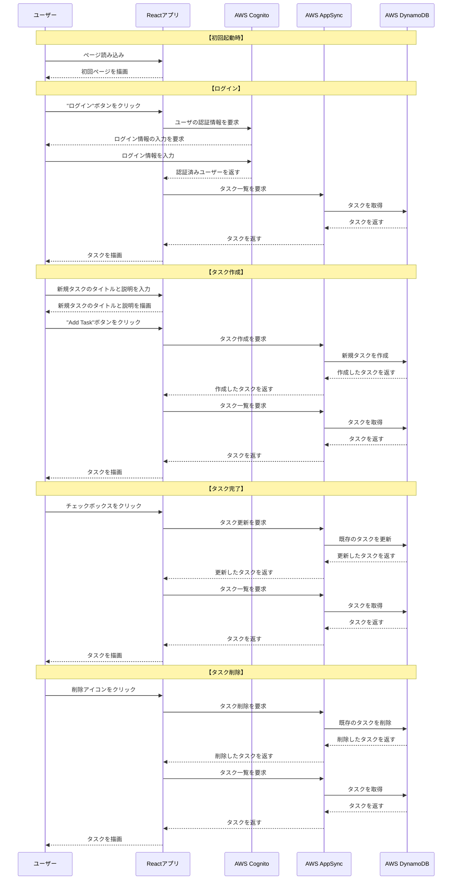

# はじめに
本記事は、AppSyncのJavaScriptリゾルバを使用してToDoリストアプリを作成したサンプルです。
CDKでAppSyncのJavaScriptリゾルバを使用したサンプルコードがあまりなかったため作成しました。
（VTLで書くのはつらい。。。）

**AppSync**や**JavaScriptリゾルバ**の解説は別の記事で行います。

今回使用するコードはGitHubに格納しています。

https://github.com/ryomeblog/cdk-js-resolvers-sample

# 事前準備
1. AWS CLIのインストール
    - [【Windows/Mac/Linux（Ubuntu）】AWS CLIインストール方法](https://qiita.com/ryome/items/efd37c3a49b54859ba68)
2. AWS IAMアカウントの作成とaws configureの設定
    - [AWS IAMアカウントの作成とaws configureの設定](https://qiita.com/ryome/items/ff2804be600cd5dcd61a)
3. Node.jsのインストール
    - [【Windows/Mac/Linux（Ubuntu）】Node.jsインストール方法](https://qiita.com/ryome/items/eec08b28aff294e8c3d6)

# 開発環境

**使用技術とバージョン**

| 技術 | バージョン |
| --- | --- |
| Node.js | v18.12.1 |
| CDK | 2.85.0 |
| React | 18.2.0 |

# インフラ構成図


# シーケンス図



# 環境構築手順

## 1. GitHubからソースコードを取得

- コマンド
```shell:コマンド
git clone https://github.com/ryomeblog/cdk-js-resolvers-sample.git
cd cdk-js-resolvers-sample/cdk
```

- 実行例
```shell:実行例
$ git clone https://github.com/ryomeblog/cdk-js-resolvers-sample.git
Cloning into 'cdk-js-resolvers-sample'...
remote: Enumerating objects: 87, done.
remote: Counting objects: 100% (87/87), done.
remote: Compressing objects: 100% (69/69), done.
remote: Total 87 (delta 20), reused 72 (delta 12), pack-reused 0
Unpacking objects: 100% (87/87), 360.23 KiB | 888.00 KiB/s, done.
$ cd cdk-js-resolvers-sample/cdk
```

:::note info
以下コマンドは、指定されたGitリポジトリをクローン（複製）するためのコマンドです。

```
git clone <リポジトリのURL>
```
:::


## 2. AWS CDK Toolkit をインストール

- コマンド
```shell:コマンド
npm install -g aws-cdk
cdk --version
```

- 実行例
```shell:実行例
$ sudo npm install -g aws-cdk && cdk --version

changed 1 package in 1s
npm notice
npm notice New minor version of npm available! 9.2.0 -> 9.7.2
npm notice Changelog: https://github.com/npm/cli/releases/tag/v9.7.2
npm notice Run npm install -g npm@9.7.2 to update!
npm notice
2.85.0 (build 4e0d726)
```

:::note info
以下コマンドは、AWS Cloud Development Kit (CDK) をインストールし、インストールされた CDK のバージョンを確認するためのコマンドです。

```
npm install -g aws-cdk && cdk --version
```
:::


## 3. 依存関係を解決

- コマンド
```shell:コマンド
npm install
```

- 実行例
```shell:実行例
$ npm install

added 284 packages, and audited 319 packages in 9s

...省略

Run `npm audit` for details.
```

:::note info
以下コマンドは、プロジェクトの依存関係をインストールするための npm コマンドです。

```shell:コマンド
npm install
```

npm（Node Package Manager）は、Node.jsのパッケージ管理ツールであり、Node.jsをインストールすると使用できます。
:::


## 4. 環境のブートストラップ

```shell:コマンド
cdk bootstrap
```

- 実行例
```shell:実行例
$ cdk bootstrap
 ⏳  Bootstrapping environment aws://【アカウントID】/【リージョン】...
Trusted accounts for deployment: (none)
Trusted accounts for lookup: (none)
Using default execution policy of 'arn:aws:iam::aws:policy/AdministratorAccess'. Pass '--cloudformation-execution-policies' to customize.

 ✨ hotswap deployment skipped - no changes were detected (use --force to override)

 ✅  Environment aws://【アカウントID】/【リージョン】 bootstrapped (no changes).
```

:::note info
以下コマンドは、AWS Cloud Development Kit (CDK) を使用してAWSアカウントにリソースをデプロイするために必要な初期セットアップを行うためのコマンドです。

```shell:コマンド
cdk bootstrap
```

詳しくは以下を参照。

https://docs.aws.amazon.com/ja_jp/cdk/v2/guide/cli.html
:::


## 5. AWS環境を作成

- コマンド
```shell:コマンド
cdk deploy
```

- 実行例
```shell:実行例
$ cdk deploy

✨  Synthesis time: 0.95s
...省略

Do you wish to deploy these changes (y/n)? y
...省略

Outputs:
CdkStack.BucketName = 【BucketName】
CdkStack.CloudFrontDistributionId = 【CloudFrontDistributionId】
CdkStack.CloudFrontURL = 【CloudFrontURL】
CdkStack.GraphQLEndpoint = 【GraphQLEndpoint】
CdkStack.UserPoolId = 【UserPoolId】
CdkStack.UserPoolWebClientId = 【UserPoolWebClientId】
Stack ARN:
arn:aws:cloudformation:【リージョン】:【アカウントID】:stack/CdkStack/xxxxxxxx-xxxx-xxxx-xxxx-xxxxxxxxxxxx

✨  Total time: 276.77s
```

:::note info
以下コマンドは、AWS Cloud Development Kit (CDK) を使用して定義したインフラストラクチャリソースをAWS環境にデプロイするためのコマンドです。

```shell:コマンド
cdk deploy
```

※ 途中で以下のように聞かれるので "y" を入力します。

```shell:質問
Do you wish to deploy these changes (y/n)? y
（これらの変更をデプロイしますか?）
```

詳しくは以下を参照。

https://docs.aws.amazon.com/ja_jp/cdk/v2/guide/cli.html
:::


:::note warn
Outputsで出力された

【CloudFrontDistributionId】,【CloudFrontURL】, 【GraphQLEndpoint】, 【UserPoolId】, 【UserPoolWebClientId】

はメモしておきます。
:::


## 6. Cognitoユーザ作成

:::note info
**sdk/CreateCognitoUserAndDomain.js** の以下の値を置き換えてから実行します。

【リージョン】：Cognitoを作成したリージョン
【UserPoolId】：「5. AWS環境を作成」でメモした【UserPoolId】
【ユーザ名】：任意の半角英数字
【メールアドレス】：任意のメールアドレス
【ドメインプレフィックス】：任意のドメインプレフィックス
:::

- コマンド
```shell:コマンド
cd ../sdk
npm install && node CreateCognitoUserAndDomain.js
```

- 実行例
```
$ npm install && node CreateCognitoUserAndDomain.js

up to date, audited 32 packages in 372ms

...省略
{
  User: {
    Username: 'test',
    Attributes: [ [Object], [Object] ],
    UserCreateDate: 2023-06-24T16:40:31.703Z,
    UserLastModifiedDate: 2023-06-24T16:40:31.703Z,
    Enabled: true,
    UserStatus: 'FORCE_CHANGE_PASSWORD'
  }
}
UserPoolDomain: 【ドメインプレフィックス】-vshgk3gh839
{}
```

:::note info
**sdk/CreateCognitoUserAndDomain.js** では、**AWS SDK（Software Development Kit）** を使用してCognitoユーザとドメインを作成しています。

詳しくは以下を参照。

**adminCreateUser**
https://docs.aws.amazon.com/ja_jp/cognito-user-identity-pools/latest/APIReference/API_AdminCreateUser.html

**createUserPoolDomain**
https://docs.aws.amazon.com/ja_jp/cognito-user-identity-pools/latest/APIReference/API_CreateUserPoolDomain.html
:::

:::note warn
コンソールに表示された **【UserPoolDomain】** とメールアドレスに送られた **【ユーザ名】** と **【パスワード】** はメモしておきます。

以下のようなメールが届きます。

```text:メール
Your username is 【ユーザ名】 and temporary password is 【パスワード】. 
```
:::


## 7. WEBアプリの依存関係を解決

:::note info
**web/src/aws-exports.js** の以下の値を置き換えてから実行します。

【リージョン】：Cognito, CloudFrontを作成したリージョン
【UserPoolId】：「5. AWS環境を作成」でメモした【UserPoolId】
【UserPoolWebClientId】：「5. AWS環境を作成」でメモした【UserPoolWebClientId】
【UserPoolDomain】：「6. Cognitoユーザ作成」でメモした【UserPoolDomain】
【CloudFrontURL】：「5. AWS環境を作成」でメモした【CloudFrontURL】
【GraphQLEndpoint】：「5. AWS環境を作成」でメモした【GraphQLEndpoint】
:::

- コマンド
```shell:コマンド
cd ../web
npm install && npm run build
```

- 実行例
```shell:実行例
$ cd ../web

$ npm install && npm run build

up to date, audited 2592 packages in 5s
...省略

  npm install -g serve
  serve -s build

Find out more about deployment here:

  https://cra.link/deployment

```

:::note info
以下コマンドは、Reactアプリケーションを「ビルド」するためのコマンドです。

```shell:コマンド
npm run build
```

※ ビルドとは、開発者が書いたコード（Reactであれば主にJavaScriptやJSX、CSSなど）を、ブラウザが解釈できる形式に変換し、最適化する一連のプロセスを指します。
:::


## 8. WEBアプリのデプロイ

:::note info
**cdk/bin/cdk.js** の **webdeploy** を **true** にします。

```diff_javascript:cdk/bin/cdk.js
#!/usr/bin/env node
import * as cdk from 'aws-cdk-lib';
import { CdkStack } from '../lib/cdk-stack.js';

const appname = 'Sample';
- const webdeploy = false;
+ const webdeploy = true;

const app = new cdk.App();
new CdkStack(app, 'CdkStack', {appname, webdeploy});
```
:::

- コマンド
```shell:コマンド
cd ../cdk
cdk deploy
```

- 実行例
```shell:実行例
$ cd ../cdk

$ cdk deploy

✨  Synthesis time: 0.98s
...省略
Outputs:
CdkStack.BucketName = 【BucketName】
CdkStack.CloudFrontDistributionId = 【CloudFrontDistributionId】
CdkStack.CloudFrontURL = 【CloudFrontURL】
CdkStack.GraphQLEndpoint = 【GraphQLEndpoint】
CdkStack.UserPoolId = 【UserPoolId】
CdkStack.UserPoolWebClientId = 【UserPoolWebClientId】
Stack ARN:
arn:aws:cloudformation:【リージョン】:【アカウントID】:stack/SampleCdkStack/xxxxxxxx-xxxx-xxxx-xxxx-xxxxxxxxxxxx

✨  Total time: 70.74s
```


## 9. CloudFrontのキャッシュ削除

:::note info
次のコマンドの【CloudFrontDistributionId】は、「5. AWS環境を作成」でメモした【CloudFrontDistributionId】に置き換えます。
【InvalidationId】は、 `aws cloudfront create-invalidation --distribution-id 【CloudFrontDistributionId】 --paths "/*"` コマンドで取得できます。
:::

- コマンド
```shell:コマンド
aws cloudfront create-invalidation --distribution-id 【CloudFrontDistributionId】 --paths "/*"
aws cloudfront get-invalidation --distribution-id 【CloudFrontDistributionId】 --id 【InvalidationId】
```

- 実行例
```shell:実行例
$ aws cloudfront create-invalidation --distribution-id 【CloudFrontDistributionId】 --paths "/*"
{
    "Location": "https://cloudfront.amazonaws.com/2020-05-31/distribution/XXXXXXXXXXX/invalidation/【InvalidationId】",
    "Invalidation": {
        "Id": "I2QJ6UYXXXXX",
        "Status": "InProgress",
        "CreateTime": "2023-06-24T18:45:02.853000+00:00",
        "InvalidationBatch": {
            "Paths": {
                "Quantity": 1,
                "Items": [
                    "/*"
                ]
            },
            "CallerReference": "cli-xxxxxxxxxx-xxxxxx"
        }
    }
}
$ aws cloudfront get-invalidation --distribution-id 【CloudFrontDistributionId】 --id 【InvalidationId】
{
    "Invalidation": {
        "Id": "【InvalidationId】",
        "Status": "Completed",
        "CreateTime": "2023-06-24T18:45:02.853000+00:00",
        "InvalidationBatch": {
            "Paths": {
                "Quantity": 1,
                "Items": [
                    "/*"
                ]
            },
            "CallerReference": "cli-xxxxxxxxxx-xxxxxx"
        }
    }
}
```

:::note info
以下コマンドは、CloudFrontのキャッシュを無効化するリクエストを作成します。

```shell:コマンド
aws cloudfront create-invalidation --distribution-id 【CloudFrontDistributionId】 --paths "/*"
```

以下コマンドは、指定したInvalidationIdのキャッシュ無効化リクエストのステータスを取得します。

```shell:コマンド
aws cloudfront get-invalidation --distribution-id 【CloudFrontDistributionId】 --id 【InvalidationId】
```

`"Status": "InProgress"` はキャッシュ削除実行中です。
`"Status": "Completed"` になっていればキャッシュ削除は成功しています。

詳しくは以下を参照

**create-invalidation**
https://docs.aws.amazon.com/cli/latest/reference/cloudfront/create-invalidation.html

**get-invalidation**
https://docs.aws.amazon.com/cli/latest/reference/cloudfront/get-invalidation.html
:::

## 10. 動作確認

:::note info
「5. AWS環境を作成」でメモした【CloudFrontURL】にアクセスして動作確認をします。
:::


# JavaScriptリゾルバ開発

`cdk/resolvers` 内にリゾルバがJavaScriptで書かれているので、それらを修正して `cdk deploy` コマンドを実施することで開発を行うことができます。

## JavaScriptリゾルバについておさらい

- AppSyncのリゾルバはパイプラインで `最大10個` の関数を設定でき、各関数は `データソースに接続` します。
- リゾルバが呼び出されると、設定された `関数が順番に実行` されます。
- JavaScriptでリゾルバや関数を定義するには、 `リクエストハンドラ` と `レスポンスハンドラ` の2つの関数を用意する必要があります。

**実行の流れ**

1. パイプライン リゾルバ リクエストハンドラ (ステップの前)
2. 機能 1: 関数リクエストハンドラ
3. 機能 1: データソースの呼び出し
4. 機能 1: 関数レスポンスハンドラ
5. 機能 2: 関数リクエストハンドラ
6. 機能 2: データソースの呼び出し
7. 機能 2: 関数レスポンスハンドラ
...
8. パイプライン リゾルバ レスポンスハンドラ (ステップ後)


※ 画像の引用元：[AWS AppSync GraphQL API の JavaScript リゾルバをはじめよう](https://aws.amazon.com/jp/blogs/news/getting-started-with-javascript-resolvers-in-aws-appsync-graphql-apis/)

:::note info
JavaScriptリゾルバの詳細は以下

**Resolver reference (JavaScript)**
https://docs.aws.amazon.com/appsync/latest/devguide/resolver-reference-js-version.html

:::


# お片付け

## 1. S3バケットを空にする

:::note info
次のコマンドの【BucketName】は、「5. AWS環境を作成」でメモした【BucketName】に置き換えます。
:::

- コマンド
```shell:コマンド
aws s3 rm s3://【BucketName】 --recursive
```

- 実行例
```shell:実行例
$ aws s3 rm s3://【BucketName】 --recursive
delete: s3://【BucketName】/index.html
delete: s3://【BucketName】/asset-manifest.json
delete: s3://【BucketName】/logo192.png
delete: s3://【BucketName】/favicon.ico
delete: s3://【BucketName】/manifest.json
delete: s3://【BucketName】/static/css/main.e6c13ad2.css.map
delete: s3://【BucketName】/logo512.png
delete: s3://【BucketName】/static/css/main.e6c13ad2.css
delete: s3://【BucketName】/static/js/787.d1d4a2c2.chunk.js
delete: s3://【BucketName】/robots.txt
delete: s3://【BucketName】/static/js/main.10f941d8.js
delete: s3://【BucketName】/static/js/main.10f941d8.js.LICENSE.txt
delete: s3://【BucketName】/static/js/787.d1d4a2c2.chunk.js.map
delete: s3://【BucketName】/static/js/main.10f941d8.js.map
```

:::note info
以下コマンドは、指定したAmazon S3 バケットの全てのオブジェクト（ファイル）を削除します。

```shell:コマンド
aws s3 rm s3://【BucketName】 --recursive
```

詳しくは以下を参照

https://docs.aws.amazon.com/cli/latest/reference/s3/rm.html
:::


## 2. AWS環境を削除

- コマンド
```shell:コマンド
cdk destroy
```

- 実行例
```shell:実行例
$ cdk destroy
Are you sure you want to delete: CdkStack (y/n)? y
CdkStack: destroying... [1/1]

 ✅  CdkStack: destroyed
```

:::note info
以下コマンドは、CDK アプリケーションによってAWS環境にデプロイされたリソースを削除します。

```shell:コマンド
cdk destroy
```

※ 途中で以下のように聞かれるので "y" を入力します。

```shell:質問
Are you sure you want to delete: CdkStack (y/n)? y
（削除してもよろしいですか？）
```

詳しくは以下を参照

https://docs.aws.amazon.com/ja_jp/cdk/v2/guide/cli.html
:::

## 3. Cognitoを削除

:::note info
次のコマンドの【UserPoolId】は、「5. AWS環境を作成」でメモした【UserPoolId】に置き換えます。
【UserPoolDomainプレフィックス】は、「6. Cognitoユーザ作成」でメモした【UserPoolDomain】（プレフィックス部分のみ）に置き換えます。
:::

:::note warn
【UserPoolDomain】は、【プレフィックス】部分のみ使用します。

```text:UserPoolDomain
【UserPoolDomainプレフィックス】.auth.【リージョン】.amazoncognito.com
```
:::

- コマンド
```shell:コマンド
aws cognito-idp delete-user-pool-domain --domain 【UserPoolDomainプレフィックス】 --user-pool-id 【UserPoolId】
aws cognito-idp delete-user-pool --user-pool-id 【UserPoolId】
```

- 実行例
```shell:実行例
$ aws cognito-idp delete-user-pool-domain --domain 【UserPoolDomainプレフィックス】 --user-pool-id 【UserPoolId】
$ aws cognito-idp delete-user-pool --user-pool-id 【UserPoolId】
```

:::note info
以下コマンドは、Amazon Cognito User PoolのドメインとUser Pool自体を削除するコマンドです。

```shell:コマンド
aws cognito-idp delete-user-pool-domain --domain 【UserPoolDomainプレフィックス】 --user-pool-id 【UserPoolId】
aws cognito-idp delete-user-pool --user-pool-id 【UserPoolId】
```

詳しくは以下を参照

**delete-user-pool-domain**
https://docs.aws.amazon.com/cli/latest/reference/cognito-idp/delete-user-pool-domain.html

**delete-user-pool**
https://docs.aws.amazon.com/cli/latest/reference/cognito-idp/delete-user-pool.html
:::


# GitHub

今回の記事で紹介したソースコードをGitHubで公開しています。

https://github.com/ryomeblog/cdk-js-resolvers-sample


# 参考文献
- https://docs.aws.amazon.com/cdk/api/v2/docs/aws-cdk-lib.aws_appsync-readme.html#js-functions-and-resolvers
- https://docs.aws.amazon.com/ja_jp/appsync/latest/devguide/resolver-reference-overview-js.html
- https://aws.amazon.com/jp/blogs/news/getting-started-with-javascript-resolvers-in-aws-appsync-graphql-apis/
